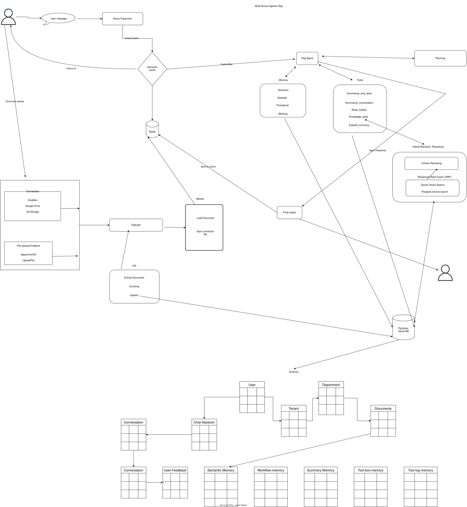

## Groundly AI – Multi-Tenant Enterprise RAG Platform
Groundly AI is a production-ready, multi-tenant Retrieval-Augmented Generation (RAG) platform that enables organizations to securely search, retrieve, and interact with internal knowledge using natural language. Built with FastAPI, PostgreSQL (pgvector), Redis, and Google Gemini, the platform allows employees to ask questions across company documents while enforcing tenant, department, and role-based access controls. Groundly combines semantic search, keyword search, reranking, conversational memory, and intelligent agents to deliver accurate, cited, and secure responses.

## Features
- Multi-tenant architecture with complete tenant isolation.
- Department and role-based document access.
- Hybrid Retrieval (Vector Search + Full-Text Search).
- Input and output Guardrails
- Cohere reranking for improved retrieval quality.
- AI-powered conversational search using Google Gemini.
- Semantic response caching with RedisVL.
- PDF citations with page references.
- Document ingestion pipeline with asynchronous processing.
- Support for large enterprise knowledge bases.
- Conversation history and persistent chat sessions.
- Background workers powered by ARQ.
- Connectors: connect document from another source
- Observability with Prometheus and Grafana 

## System Architecture Diagram


## System Screenshot
### Dashboard


### Invite user to department


### Department


### ChatUI


### Connectors


### Document Upload


### Settings


## Tech Stack
 - Python
 - FastApi
 - React
 - TenStack Query
 - Pgvector
 - PostgreSQL
 - AsyncPG
 - SQLModel
 - Redis 
 - RedisVL
 - Guardrail AI
 - Google Gemini
 - Cohere Reranking
 - ARQ
## Python Package Manager
 - uv


## Supported Document
 - PDF

## Supported Connectors
- DropBox
- Google Drive
- S3 Digital ocean, Aws

## Evaluation

Groundly is evaluated using Ragas across a curated dataset. The evaluation report and methodology are available in the evaluation directory.

## Use Cases

Groundly is designed for organizations that need secure AI-powered knowledge retrieval, including:

- Insurance
- Banking
- Healthcare
- Legal
- Internal Knowledge Bases
- Enterprise Documentation

## infrastructure
 - docker
 - Docker Compose

## Project Structure
```
Backend/
Frontend/
compose.yml
```

## Project Setup
 ### 1. clone Repository
    ```bash
    git clone https://github.com/owolabi-develop/MemRag.git
    ```
 ### 2. Create .env file for both Frontend and backend in root folder

### backend .env 
- DB_NAME=""
- DB_USER=""
- DB_PASSWORD=""
- DB_HOST=""
- DB_PORT=5432
- REDIS_SERVER="redis"
- REDIS_PORT=6379
- PGADMIN_MAIL=""
- PGADMIN_PW=""
- SECRET_KEY=""
- ALGORITHM="HS256"
- GUARDRAILS=""
- ACCESS_TOKEN_EXPIRE_MINUTES=48
- GOOGLE_CLOUD_LOCATION="us-central1"
- APP_NAME=Groundly
- PASSWORD_RESET_TOKEN_EXPIRE_MINUTES=30
- FRONTEND_HOST="http://localhost" without docker http://localhost:8080
- SMTP_HOST=
- SMTP_PORT=465
- SMTP_TLS=true
- SMTP_SSL=false
- SMTP_USER=
- SMTP_PASSWORD=
- EMAILS_FROM_EMAIL=
- EMAILS_FROM_NAME=Groundly
- INVITE_TOKEN_EXPIRE_MINUTES=4320
- SPACES_SECRET=""
- SPACES_KEY=""
- SPACES_BUCKET_NAME_KB="groundlykb"
- SPACES_ENDPOINT="https://sfo3.digitaloceanspaces.com"
- SPACES_REGION="sfo3"
### frontend .env
- VITE_API_URL=http://localhost/api/v1 

## Running locally
### 1. Start the backend and frontend services using Docker Compose
```bash
docker-compose up --build
```

## Start the backend services
### Note: update your database setting on code inside connection.py and db.py

```bash
cd backend
uv .venv
uv sync
fastapi dev
```
## start 
the frontend services
```bash 
cd frontend/Mem-rag
npm install
npm run dev
```

## login/signup
- Navigate to http://localhost/login
- Navigate to http://localhost/register
## backend APi
- Navigate to http://localhost/api/v1/docs
## pgadmin
- Navigate to http://localhost.db
## Prometheus
 #### Available on docker
- Navigate to http://promethus.localhost

## Grafana
#### Available on docker
- Navigate to http://grafana.localhost


 


